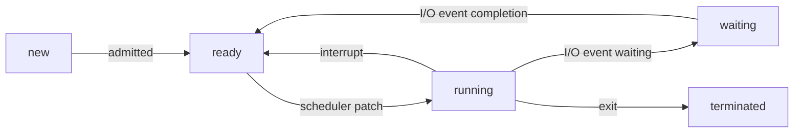

# java-lang-test

#### 介绍

java语言学习 和 设计模式

### 1 設計模式(design pattern)

三類設計模式:

- 创建型模式: 工厂模式、单例模式、抽象工厂模式、建造者模式、原型模式

- 结果型模式: 装饰器模式、适配器模式、代理模式、桥接模式、组合模式、外观模式、享元模式

- 行为型模式: 责任链模式、观察者模式、访问者模式、模板方法模式、命令模式、迭代器模式、中介者模式、备忘录模式、解释器模式、状态模式、策略模式


*singleton 6种实现*

```java

public class Singletons {
  
  // the most simple implementation of Singleton pattern
  public static class MSSingleton {
    private MSSingleton(){}
    private static MSSingleton singleton = new MSSingleton();
    public static MSSingleton getInstance() {
      return singleton;
    }
  }

  // lazy initialize way
  // not thread safe
  public static class LazySingleton {
    private LazySingleton(){}
    private static LazySingleton singleton;

    public static LazySingleton instance() {
      if(Objects.isNull(singleton)){
        singleton = new LazySingleton();
      }
      return singleton;
    }
  }


  // lazy && thread safe
  public static class LazyThreadSafeSingleton {
    private LazyThreadSafeSingleton() {}

    private static LazyThreadSafeSingleton singleton;

    public static synchronized LazyThreadSafeSingleton instance() {
      if(Objects.isNull(singleton)) {
        singleton = new LazyThreadSafeSingleton();
      }
      return singleton;
    }
  }

  // double-checking locking

  public static class DoubleCheckingLockSingleton {
    private DoubleCheckingLockSingleton () {}
    private static volatile DoubleCheckingLockSingleton singleton;

    /**
     * {@code 
     * thread1 -> t1
     * thread2 -> t2
     *        t1      t2
     *        ||      ||
     * 
     *        volatile(可见性， 保证一个线程修改以后其他线程能够看见修改内容)
     *   第一次判读singleton是否是空
     *      singleton is null
     * 
     *        ||      ||
     *        ||      
     *        ||  singleton not null -------------------++----++ 
     *        ||                                        ||    ||
     *        ||      ||                                \/    \/
     *        \/      \/                           return singleton
     *       synchronized
     *            ||
     * 
     *        t1(or t2)
     * 
     *            ||
     * 
     *         new Singleton
     * 
     *            ||
     *            ||
     * 
     *    t1(or t2) finished & return
     * 
     *            ||
     *            \/
     * 
     *        t2(or t1)
     * 
     *            ||
     * 
     *      do nothing & return 
     * 
     *            ||
     *            \/
     * }
     * 
     * @return
     */
    public static DoubleCheckingLockSingleton instance() {
      if(Objects.isNull(singleton)) {
        // 可见性 轻度锁
        synchronized (DoubleCheckingLockSingleton.class) {
          // 初始化时加锁 
          if(Objects.isNull(null)){
            singleton = new DoubleCheckingLockSingleton();
          }
        }
      }
      return singleton;
    }
  }

  public static class InnerClassRegisteSingleton {
    private InnerClassRegisteSingleton(){}
    static final class SingletonHolder{
      public static InnerClassRegisteSingleton singleton = new InnerClassRegisteSingleton();
    }

    public static InnerClassRegisteSingleton instance() {
      return SingletonHolder.singleton;
    }

  }

  public static enum EnumSingleton {
    Instance;
  }
}
```

*装饰器模式*

对于面向对象语言来说，当你想更改一个类型的对象的行为时可以通过继承来覆盖原有的方法。

但是继承可能引发几个严重的问题。

1. 

> reference: 

> https://refactoringguru.cn/design-patterns

> https://github.com/youlookwhat/DesignPattern

> [菜鸟教程](https://www.runoob.com/design-pattern/design-pattern-tutorial.html)

### 2 MethodHandle

java.lang.invoke 包提供一种动态调用的方法, 称为方法句柄(MethodHandle)。可以通过`java.lang.invoke.MethodHandles`的`lookup`创建一个`MethodHandles.Lookup`, 该类可以获取对应类的方法句柄。

例如：

```java
public class MethodHandleTest {
  public static void main(String[] args) {
    final MethodHandles.Lookup lookup = MethodHandles.lookup();
    final MethodHandle method = lookup.findStatic(MethodHandleTest.class, "function", MethodType.methodType(void.class));
    method.invoke();
  }

  public static void function(){
  }
}
```

`findStatic`用于生成静态方法的方法句柄. 该函数需要传入3个参数，第一个是要查找的类，第二个是要查找的方法的名称，第三个是要查找的方法的类型，该类型通过方法的返回值和参数确定。方法类型通过`java.lang.invoke.MethodType`类型确定,可以通过工厂方法`MethodType#methodType`创建，该方法第一个入参是函数的返回值，后面的可选参数是函数的入参。

与`findStatic`类似的方法还有:`findSpecial`,`findGetter`,`findSetter`,`findStaticGetter`,`findStaticSetter`和`findVirtual`等。

类似`**Getter`和`**Setter`是生成操作field的方法句柄，主要是获取对应field的进行设置或获取的操作，有点类似于JavaBean的Getter,Setter方法。

`findSpecial`是获取`final`或`private`修饰的方法.

`findVirtual`是获取虚方法的句柄，就是那些具有多态性质的函数。

*参考*:
《深入理解java虚拟机》周志明

### 3 record

Java中Record类型java14预览，java16开始正式支持.

> reference :

> [Data Oriented Programming in Java](https://www.infoq.com/articles/data-oriented-programming-java/#:~:text=Data%20oriented%20programming%20in%20Java%20Records%2C%20sealed%20classes%2C,and%20type-safe%20way%20of%20acting%20on%20polymorphic%20data.)

> [实战 Java 16 值类型](https://cloud.tencent.com/developer/article/1814757)

> [openjdk record](https://openjdk.org/jeps/395)


### 4 Java 引用

Java将引用分为`强引用`、`软引用`、`弱引用`、`虚引用`.

- 强引用是传统的引用的定义，是指传统的引用赋值方式, 如`A a = new A()`。无论任何情况下，只要强引用关系存在，垃圾收集器就永远不会回收掉被引用的对象.

- 软引用是用来描述一些还有用，但非必须的对象。只被软引用关联(软引用可达)的对象，当内存不足时垃圾回收器才会回收这些对象。
由于软引用可到达的对象比弱引用可达到的对象滞留内存时间会长一些，可以利用这个特性来做缓存。这样的话，就可以节省很多事情，垃圾回收器会关心当前哪种可到达类型以及内存的消耗程度来进行处理。

- 弱引用是用来描述那些非必要的对象，它的强度比软引用更弱一些。如果垃圾收集器在某个时间点上确定一个对象是若可达(只存在弱引用)，垃圾回收器就会回收该对象。

```java

@Test
public void test(){
  System.out.println("start creating reference ...");
  WeakReference<Object> weakReference = new WeakReference<Object>(new Object());
  Object strongReference = new Object();
  System.out.println("ending creating reference");
  System.out.println(String.format("weak-reference is null ? %b", Objects.isNull(weakReference.get())));
  System.out.println(String.format("strong-reference is null ? %b", Objects.isNull(strongReference)));
  System.out.println("starting call gc");
  System.gc();
  try {
    Thread.sleep(100);
  } catch (InterruptedException e) {
    log.error("sleep error", e);
  }
  System.out.println("gc finish");
  System.out.println(String.format("weak-reference is null ? %b", Objects.isNull(weakReference.get())));
  System.out.println(String.format("strong-reference is null ? %b", Objects.isNull(strongReference)));
}

```

*运行打印结果*:

> start creating reference ...

> ending creating reference

> weak-reference is null ? false

> strong-reference is null ? false

> starting call gc

> gc finish

> weak-reference is null ? true

> strong-reference is null ? false

**WeakHashMap**

基于哈希表的Map接口的实现，具有弱键 。 WeakHashMap的条目在其密钥不再正常使用时将自动删除。 更确切地说，给定密钥的映射的存在不会阻止密钥被垃圾收集器丢弃，即，可以最终化，最终化，然后回收。 当一个键被丢弃时，它的条目将被有效地从地图中删除，因此该类的行为与其他Map实现略有不同。

WeakHashMap的弱键特性利用了`WeakReference`的特性，`WeakHashMap`的`Entry`的实现是继承了`WeakReference`的。WeakHashMap的Entry的弱引用是`K`，也就是HashMap里面键值对的键。因此如果WeakHashMap里面的某一个`K`不存在任何强引用时对应的K就会被回收.

*那么WeakHashMap是如何实现除了key以外整个Entry对象从HashMap删除的呢?*

在WeakHashMap里有一个函数叫`expungeStaleEntries`

```java
// WeakHashMap#expungeStaleEntries
/**
 * Expunges stale entries from the table.
 */
private void expungeStaleEntries() {
  for (Object x; (x = queue.poll()) != null; ) {
    synchronized (queue) {
      @SuppressWarnings("unchecked")
        Entry<K,V> e = (Entry<K,V>) x;
      int i = indexFor(e.hash, table.length);

      Entry<K,V> prev = table[i];
      Entry<K,V> p = prev;
      while (p != null) {
        Entry<K,V> next = p.next;
        if (p == e) {
          if (prev == e)
            table[i] = next;
          else
            prev.next = next;
          // Must not null out e.next;
          // stale entries may be in use by a HashIterator
          e.value = null; // Help GC
          size--;
          break;
        }
        prev = p;
        p = next;
      }
    }
  }
}
```

该函数会去遍历一个`ReferenceQueue`检查所有被回收的`WeakReferece`也就是被回收Key对应的Entry，然后将该Entry回收。
而该函数会在调用`WeakHashMap`的总体信息的函数时被调用，如: `size`,`getTable`。

```java
/**
 * Returns the table after first expunging stale entries.
 */
private Entry<K,V>[] getTable() {
  expungeStaleEntries();
  return table;
}

/**
  * Returns the number of key-value mappings in this map.
  * This result is a snapshot, and may not reflect unprocessed
  * entries that will be removed before next attempted access
  * because they are no longer referenced.
  */
public int size() {
  if (size == 0)
      return 0;
  expungeStaleEntries();
  return size;
}
```


- 虚引用也称为"幽灵引用"或者"幻影引用"，它是一个最弱的一种引用关系。一个对象是否存在虚引用完全不会对其生存时间构成影响，也无法通过虚引用来获取一个对象实例。为一个对象设置虚引用关联的唯一目的只是为了能在这个对象被回收到时收到一个系统通知。


> reference :

> 《深入理解java虚拟机》周志明

### 5 AutoCloseable

java 1.7 之后实现了AutoCloseable的对象可以通过try - with - resources 语法实现自动关闭资源

例如:

```java
// AutoCloseableObj.java
public class AutoCloseableObj implements AutoCloseable{

  @Override
  public void close() throws Exception {
    System.out.println("auto closing ....");
  }
  
}

// AutoCloseTest
public class AutoCloseTest {

  @Test
  public void test() {
    try (var obj = new AutoCloseableObj()){
    }catch(Exception e){
    }
  }
}

/**
 * 最后会打印: auto closing ....
 */

```

### 6 ThreadLocal

ThreadLocal用于实现线程之间的变量隔离，ThreadLocal提供的线程局部变量与普通的线程局部变量之间的区别是，ThreadLocal提供的线程局部变量的作用域是整个线程，而普通的线程局部变量的作用域是方法。

ThreadLocal通过`ThreadLocal.ThreadLocalMap`来保存变量，对于每一个线程都会有一个成员变量叫`threadLocals`存储的就是`ThreadLocal.ThreadLocalMap`变量。

ThreadLocal的#get方法获取变量实际上就是获取`Thread.threadLocals`的变量。

### ThreadLocal.ThreadLocalMap

ThreadLocal.ThreadLocalMap实际上是通过hash表来存储局部线程局部变量的，哈希表的节点是一个继承自`WeakReference`的键值对，该键值对以ThreadLocal提供的hash值为做为键来做hash索引。
该hash值是一个`AtomicInteger`类型的不断递增的值，因此对于每一个ThreadLocal提供的hash值对于所有线程是唯一的。该特性保证了每当创建一个ThreadLocal当前线程只会有唯一的hash值与之对应。

ThreadLocal#get方法最终都会去查找当前线程的threadLocals的数据，因此，每个线程创建的Threadlocal的值都只会属于当前线程。

### 7 enum (枚举)

[reference](https://blog.csdn.net/jisuanji12306/article/details/79356558)

```java

public class EnumTest {

  @Test
  public void test() {
    final int a = 100,b = 13;
    for(IntOp op : IntOp.values()){
      System.out.println(String.format("op-%s-(%d,%d)-%d", op, a, b, op.apply(a, b)));
    }
    // op-ADD-(100,13)-113
    // op-DEVIDE-(100,13)-7
  }


  static enum IntOp {
    ADD {
      @Override
      public int apply(int a, int b) {
        return a + b;
      }
    },
    DEVIDE {

      @Override
      public int apply(int a, int b) {
        return a / b;
      }
    };
    public abstract int apply(int a, int b);
  }
}
```

### 8 for-in


for-in 循环语句是Java 1.5的新特征之一，在遍历数组、集合方面，for-in为开发者提供了极大的方便。for-in 循环语句是 for 语句的特殊简化版本，主要用于执行遍历功能的循环。

语法格式:

`for (type var : collection) {`

`  block;`

`}`

for-in适用于数组和任何**Collection**对象。(`for-in`语句适用于数组或者其它任何**Iterable**)

*参考: onJava*

### 9 Collections.shuffle

打乱列表元素

```java

List<Integer> list = Stream.generate(new Supplier<Integer>() {
  Random random = new Random();
  @Override
  public Integer get() {
    return random.nextInt();
  }
})
.limit(10)
.collect(Collectors.toList());
list.forEach(el -> System.out.printf("%d ", el));
System.out.println();
Collections.shuffle(list);
list.forEach(el -> System.out.printf("%d ", el));
System.out.println();
// 944377481 -720786430 702573091 1299273027 885662345 1287353883 382365354 -1409717507 -1455871407 -1702050819
// 702573091 1299273027 -720786430 -1409717507 382365354 885662345 1287353883 944377481 -1702050819 -1455871407

```

### 10 Java几种类

**内部类**定义在一个类的内部的类，内部类分为:

| 类型            | 中文名称 |
| --------------- | -------- |
| static class    | 静态类   |
| member  class   | 成员     |
| local class     | 局部类   |
| anonymous class | 匿名类   |

静态类(static class):
不用创建外部类的对象就可以直接创建static class的对象。静态类可以访问外部类的静态成员，但是无法访问外部类的非静态成员。
成员类(member class):
只有创建了外部类才可以创建成员类。
局部类(local class):
定义在函数内部的类，局部类的函数只能引用final修饰的或功能类似于final的变量。
匿名类(anonymous class):

### 11 Java可变参数(Varargs)

java可变参数是指那些定义在函数参数中，类型确定但是长度可变的参数，对于这样的参数可以传值也可以不传值，参考如下：

```java

public class VarargsTest {
  public void testVarargs(String ...args) {
    if(args.length == 0) {
      System.out.println("args is empty");
    }else {
      System.out.printf("args length is %d\n", args.length);
    }
  }
  
  public void test() {
    testVarargs();
    testVarargs("1", "2");
  }
}

```

Java 最后将可变长度的参数封装成为一个数组。数组元素的类型就是可变长度参数的类型（即…之前的类型，在上面的例子中就是 int），数组的名称是参数名称（在上面的例子中是 nums）。

*使用限制*

1. 变长参数必须是方法中的最后一个参数，避免无法区分变长参数和普通参数；

2. 一个方法不能定义多个变长参数，避免参数错位

3. 变长参数位置如果被同等类型数组替代，不能构成重载，因为本质上是一个方法。

```java
public static void fun(int ...nums){}

public static void fun(int[] nums){}
```

上面的两个方法实际是一个方法，在同一个类中不能通过编译。


### 12 Reflection(反射)

**java-in-action**

> 反射是运行时程序能够检测自身及其运行环境，并根据检测结果改变其行为的能力。
>
> 要实施这种自检，程序需要一种表示自身的形式。我们称这种信息为元数据。在面向对象的世界里，元数据被组织为对象，成为元对象，元对象的运行时自检被称为内省。
>
> 正如前面例子所示，内省之后，紧跟着是行为的改变。通常反射 API 可以使用 3 种技术改变程序的行为：
>
> 直接修改原对象
> 通过元对象做一些操作（比如动态方法调用）
> 调解，在程序运行的许多阶段，代码被禁止调解。
> Java 提供了丰富的对于元数据的操作，仅提供有限的重要调解能力。并且，Java 通过完全禁止直接修改元数据避免了很多复杂性。
>
> 这些反射特性可以让程序非常灵活。使用反射的应用对于变化的需求更容易适应。反射组件在其他应用中更容易复用，这些好处在现代 Java 中触手可及。
> 
> <p align="right"> ——《 java in action 》</p>

*自省*

> 自省是指一种可以让程序检查自身的反射特性.

*元对象*
> 我们称可以作为程序自我表示的对象为**元对象***（metaobjects），`meta` 是一个英文前缀，通常表示关于或超越，在这里，`metaobjects` 是持有关于程序的信息的对象。

**开始使用反射**

java对象可以通过`getClass`方法获取`java.lang.Class`对象.

```java
Class cls = obj.getClass();
```

`getClass` 方法可以在运行时查询对象的类型，该方法经常用在反射程序的最开始，因为很多反射任务都需要查询对象的类型，`getClass` 方法定义在 `java.lang.Object` 对象中，所以任何 Java 对象都可以调用 `getClass` 方法。

`getClass` 方法返回 `java.lang.Class` 对象的一个实例，`Class` 对象的实例是 Java 中的**元对象**，我们使用 **类对象**（`class object`）来称呼 `java.lang.Class` 对象的实例。类对象是 Java 中最重要的元对象，因为所有 Java 程序都是由类组成的。

类对象提供关于类的域、方法、构造器、嵌套类等的元数据，还提供了关于继承层次的信息。


**获取通过反射获取类的方法**

```java
Method method = cls.getMethod("methodName", /** 方法参数类型 */new Class[]{void.class})
```

`Class.getMethod`可以根据方法名称和方法的参数类型获取类里的对应的方法。第一个参数是要查询的方法名字，第二个参数是**类对象数组**（`an array of class objects`）。第二个参数所代表的列表的第一个实例是该方法的返回值，后面的元素是该方法的入参类型。

**获取`java.lang.Class`**

- `getClass` 方法：适用已知对象，获取对象的类对象。
- `.class` 类型字面值：适用于 **仅知道类型名**，获取该类型名的类对象。

任何 **类名** 后加 `.class` 都会得到一个类对象

```java
Class strCls = String.class;
Class intCls = int.class;
```

**获取对象方法**

| 方法  | 描述  |
| --- | --- |
| `Method` getMethod(String name, `Class[]` parameterTypes) | 返回表示 `public` 方法的 `Method` 对象，**继承**、**自身声明** 皆可 |
| Method[] getMethods() | 返回 `Method` 数组，包含所有 `public` 方法，**继承**、**声明**皆可 |
| Method getDeclaredMethod(String name, `Class[]` parameterTypes) | 返回表示 **自身声明** 的方法的 `Method` 对象 |
| Method[] getDeclaredMethods() | 返回 Method 数组，表示该类 **声明** 的所有方法，包括 `public`/`private`/`protected`/`package` 方法 |

对于原始类型、数组、接口，Java 通过引入 `Class` 对象（`Class` 对象就是普通类）来表示，这些 `Class` 对象与普通 `Class` 对象相比有很多 **局限性***，比如无法创建原始类型、接口的实例，但它们对于自省而言非常重要，`Class` 中支持 **类型表示** 的方法如下表所示：

| 方法  | 说明  |
| --- | --- |
| String getName() | 返回 `Class` 对象的 **全限定名** |
| Class getComponentType() | 若调用方法的 `Class` 对象代表数组，则返回 **数组元素** 的类型 |
| boolean isArray() | 如果调用方法的 `Class` 对象代表数组，则为 `true` |
| boolean isInterface() | 如果调用方法的 `Class` 对象代表接口，则为 `true` |
| boolean isPrimitive() | 如果调用方法的 `Class` 对象代表原始类型，则为 `true` |

### 13 多线程

*进程和线程*

在批处理操作系统时，对于计算机指令是串行执行的。由于在计算机进行I/O、网络等操作时会进行阻塞，这样效率会比较低。
为了提升批处理系统的效率，提出进程的概念让计算机能够在内存中存在多个程序。

这时提出进程的概念；

> 进程就是应用程序在内存中分配的空间，也就是正在运行的程序，各进程之间互不干扰。同时进程保存着程序每个时刻运行的状态。

这时计算机采用时间片轮转的方式运行进程：CPU为每个进程分配一段时间段，称作它的时间片。如果时间片结束进程还在运行，则暂停这个进程，并且将CPU分配给另一个进程（这个过程叫做上下文切换）。

> 当进程暂停时，它会保存当前进程的状态（进程标识，进程使用的资源等），下一次切换回来时根据之前保存的状态恢复，接着继续执行.

线程的提出

因为进程是资源的拥有者，所以在进程进行切换的时必须切换进程所拥有的资源，因而必须花费不少的处理时间。为了解决这个问题，引入了线程。

在引入了线程的操作系统中，通常一个进程可能会存在多个线程，并且至少会有一个线程，线程成为了处理器调度的基本单元。

线程的引入使得进程是一个资源的拥有者，不再是作为调度和分派的基本单元。

*参考：*

> 1. https://blog.csdn.net/qq_34039868/article/details/104977470


*上下文切换*

上下文切换（有时也称做进程或任务切换）是指CPU从一个进程（或线程）切换到另一个进程（或线程）。上下文是指某一时间点CPU寄存器和程序计数器的内容。

CPU为每个进程分配一段时间段来实现多线程机制。CPU通过时间片分配算法来循环执行任务，当前时间片执行结束后会切换到下一个任务。

上下文切换通常是计算密集型的,意味着此操作会消耗大量的 CPU 时间,故线程也不是越多越好。如何减少系统中上下文切换次数,是提升多线程性能的一个重点课题。

*参考：*

> 1. 深入浅出Java多线程

*线程组*

Java中用ThreadGroup来表示线程组,我们可以使用线程组对线程进行批量控制。

ThreadGroup和Thread的关系就如同他们的字面意思一样简单粗暴,每个Thread必然存在于一个ThreadGroup中,Thread不能独立于ThreadGroup存在。执行main()方法线程的名字是main,如果在new Thread时没有显式指定,那么默认将父线程(当前执行new Thread的线程)线程组设置为自己的线程组。

```java

public class ThreadTest {

  @Test
  public void testThreadGroup() {
    new Thread(new ThreadGroupNameCompare(Thread.currentThread().getThreadGroup().getName())).start();
    new Thread(() -> {
      assertNotEquals("rangeName", Thread.currentThread().getThreadGroup().getName());
    }).start();
    new Thread(() -> {
      assertEquals("main", Thread.currentThread().getThreadGroup().getName());
    }).start();
  }

  static class ThreadGroupNameCompare implements Runnable{
    private final String tgName;
    public ThreadGroupNameCompare(String tgName){
      this.tgName = tgName;
    }

    @Override
    public void run() {
      assertEquals(tgName, Thread.currentThread().getThreadGroup().getName());
    }
  }
}

```

*线程统一异常处理*

```java

  @Test
  public void testThreadGroupExceptionHandle(){
    ThreadGroup threadGroup = new ThreadGroup("thread-group-test"){
      @Override
      public void uncaughtException(Thread t, Throwable e){
        System.out.println(String.format("thread %s , exception %s", t.getName(), e.getMessage()));
      }
    };

    new Thread( threadGroup, () -> {
      throw new RuntimeException("thread group handle error");
    }).start();
  }
  // thread Thread-0 , exception thread group handle error

```

**线程状态**

操作系统状态切换



操作系统线程主要有一下三个状态：
- 就绪状态(ready) : 线程正在等待CPU，经调度程序调用之后可以进入`running`状态。
- 执行状态(running) : 线程正在使用CPU
- 等待状态(waiting) : 线程经过等待事件调用或正在等待其他资源（如I/O）

Java线程的六个状态: `New`,`RUNNABLE`,`BLOCKED`,`WAITING`,`TIMED_WAITING`,`TERMINATED`

```java

public enum State {
  /**
   * Thread state for a thread which has not yet started.
   */
  NEW,

  /**
   * Thread state for a runnable thread.  A thread in the runnable
   * state is executing in the Java virtual machine but it may
   * be waiting for other resources from the operating system
   * such as processor.
   */
  RUNNABLE,

  /**
   * Thread state for a thread blocked waiting for a monitor lock.
   * A thread in the blocked state is waiting for a monitor lock
   * to enter a synchronized block/method or
   * reenter a synchronized block/method after calling
   * {@link Object#wait() Object.wait}.
   */
  BLOCKED,

  /**
   * Thread state for a waiting thread.
   * A thread is in the waiting state due to calling one of the
   * following methods:
   * <ul>
   *   <li>{@link Object#wait() Object.wait} with no timeout</li>
   *   <li>{@link #join() Thread.join} with no timeout</li>
   *   <li>{@link LockSupport#park() LockSupport.park}</li>
   * </ul>
   *
   * <p>A thread in the waiting state is waiting for another thread to
   * perform a particular action.
   *
   * For example, a thread that has called {@code Object.wait()}
   * on an object is waiting for another thread to call
   * {@code Object.notify()} or {@code Object.notifyAll()} on
   * that object. A thread that has called {@code Thread.join()}
   * is waiting for a specified thread to terminate.
   */
  WAITING,

  /**
   * Thread state for a waiting thread with a specified waiting time.
   * A thread is in the timed waiting state due to calling one of
   * the following methods with a specified positive waiting time:
   * <ul>
   *   <li>{@link #sleep Thread.sleep}</li>
   *   <li>{@link Object#wait(long) Object.wait} with timeout</li>
   *   <li>{@link #join(long) Thread.join} with timeout</li>
   *   <li>{@link LockSupport#parkNanos LockSupport.parkNanos}</li>
   *   <li>{@link LockSupport#parkUntil LockSupport.parkUntil}</li>
   * </ul>
   */
  TIMED_WAITING,

  /**
   * Thread state for a terminated thread.
   * The thread has completed execution.
   */
  TERMINATED;
}
```

- `NEW`

线程还没有启动
从Java程序上表达就是创建了`Thread`实例但还没有调用`start`函数。
```java

  @Test
  public void testThreadState(){
    Thread t = new Thread(() -> {});
    assertEquals(Thread.State.NEW, t.getState());
  }

```

*`start`方法*

1. 不能多次调用`Thread.start`方法，第二次调用会抛出`IllegalThreadStateException`

原因: *参考-深入浅出Java多线程*

`Thread`内部存在一个变量叫`threadStatus`，在调用`start`函数的时候会判断该变量是否是0，如果不是就会抛出`IllegalThreadStateException`错误，同时在调用`start`函数后会改变`threadStatus`变量，因此第二次调用`start`函数时`threadStatus`已经改变，会抛出错误。

示例:

```java

  @Test
  public void testThreadStart() {
    assertThrows(IllegalThreadStateException.class, () -> {
      Thread t = new Thread(() -> {});
      t.start();
      t.start();
    });
  }

```

2. 在`Thread`执行结束以后再调用`start`函数是不可以的，原因参考`问题1`的回答。

- `RUNNABLE`

表示当前线程正在运行中。处于RUNNABLE状态的线程在Java虚拟机中运行,也有可能在等待其他系统资源(比如I/O)。

> Java线程的RUNNABLE状态其实是包括了传统操作系统线程的ready和running两个状态的。

- `BLOCKED`

阻塞状态，等待获取同步锁从而进入同步块或同步方法，或是通过调用`Object#wait`重新进入同步块。

- `WAITING`

由于调用`Object#wait`、`Thread#join`或`LockSupport#park`方法进入等待状态，需要其他线程唤醒.

> Object.wait():使当前线程处于等待状态直到另一个线程唤醒它;
>
> Thread.join():等待线程执行完毕,底层调用的是Object实例的wait方法;
>
> LockSupport.park():除非获得调用许可,否则禁用当前线程进行线程调度。

- `TIMED_WAITING`

超时等待状态。线程等待一个具体的时间,时间到后会被自动唤醒。

调用如下方法会使线程进入超时等待状态:
1. Thread.sleep(long millis):使当前线程睡眠指定时间;
2. Object.wait(long timeout):线程休眠指定时间,等待期间可以通过notify()/notifyAll()唤醒;
3. Thread.join(long millis):等待当前线程最多执行millis毫秒,如果millis为0,则会一直执行;
4. LockSupport.parkNanos(long nanos): 除非获得调用许可,否则禁用当前线程进行线程调度指定时间;
5. LockSupport.parkUntil(long deadline):同上,也是禁止线程进行调度指定时间;

- `TERMINATED`

终止状态。此时线程已执行完毕。

**线程之间的状态转换** @todo

```mermaid

flowchart RL
  NEW ---> | Thread.start | RUNNABLE
  BLOCKED ---> | 获取锁成功 | RUNNABLE[ready && running]
  RUNNABLE ---> | 等待锁 | BLOCKED
  WAITING ---> | Object.notify Object.notifyAll LockSupport.unpark(Thread) | RUNNABLE
  RUNNABLE ---> | Object.wait Thread.join LockSupport.park | WAITING
  TIMED_WAITING ---> | Object.notify Object.notifyAll LockSupport.unpark(Thread) | RUNNABLE
  RUNNABLE ---> | Thread.sleep(long) Object.wait(long) Thread.join(long) LockSupport.parkNanos LockSupport.parkUnit | TIMED_WAITING

```

1. BLOCKED --> RUNNABLE

线程转化为`waiting state`可以通过如下方法:

- Object.wait
- Thread.join
- LockSupport.park

示例代码(wait)

```java

  Object lock = new Object();

  @Test(timeout = 2000)
  public void testThreadWait(){
    System.out.printf("start run at %d\n", LocalTime.now().getSecond());
    Thread mainthread = Thread.currentThread();
    System.out.printf("main thread state is %s\n", mainthread.getState());
    new Thread(() -> {
      try {
        Thread.sleep(1000);
      } catch (InterruptedException e) {
        e.printStackTrace();
      }finally{
        synchronized(lock){
          System.out.printf("main thread state is %s(sub thread before notifyAll)\n", mainthread.getState());
          lock.notifyAll();
          System.out.printf("main thread state is %s(sub thread)\n", mainthread.getState());
          System.out.printf("stop wait at %d\n", LocalTime.now().getSecond());
        }
      }
    }).start();
    try {
      synchronized(lock){
        System.out.printf("wait lock at %d\n", LocalTime.now().getSecond());
        lock.wait();
        System.out.printf("main thread state is %s(in main after wait finish)\n", mainthread.getState());
      }
    } catch (InterruptedException e) {
      e.printStackTrace();
    }
    System.out.printf("finish run at %d\n", LocalTime.now().getSecond());
  }

  // prints 打印结果
// start run at 31
// main thread state is RUNNABLE
// wait lock at 31
// main thread state is WAITING(sub thread before notifyAll)
// main thread state is BLOCKED(sub thread)
// stop wait at 32
// main thread state is RUNNABLE(in main after wait finish)
// finish run at 32

```

### 14 初始化array

```java
int[] a = new int[]{1,2};
int[] a = {1,2};

class A {}

A[] as = { new A(), new A()};
A[] as2 = new A[]{ new A()};

```
