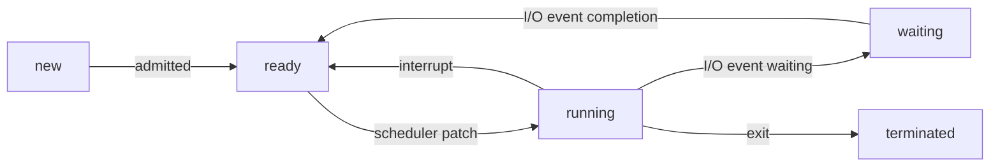
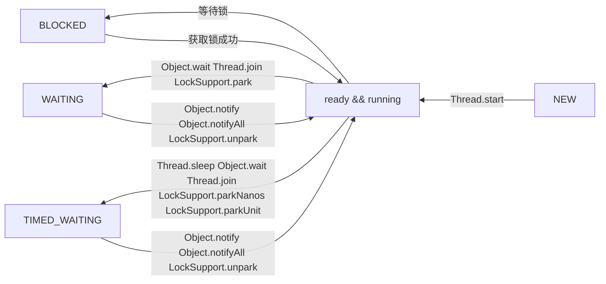

# java-lang-test

#### 介绍

java语言学习 和 设计模式

### 0 vmy 

<p align="right"> —— my simple language</p>

个人语言实现 vmy

源码(source code) : com/silence/vmy

[doc](./src/main/java/com/silence/vmy/Readme.md)

vmy脚本(scripts write in vmy) : scripts


### 1 設計模式(design pattern)

三類設計模式:

- 创建型模式: 工厂模式、单例模式、抽象工厂模式、建造者模式、原型模式

- 结果型模式: 装饰器模式、适配器模式、代理模式、桥接模式、组合模式、外观模式、享元模式

- 行为型模式: 责任链模式、观察者模式、访问者模式、模板方法模式、命令模式、迭代器模式、中介者模式、备忘录模式、解释器模式、状态模式、策略模式


*singleton 6种实现*

```java

public class Singletons {
  
  // the most simple implementation of Singleton pattern
  public static class MSSingleton {
    private MSSingleton(){}
    private static MSSingleton singleton = new MSSingleton();
    public static MSSingleton getInstance() {
      return singleton;
    }
  }

  // lazy initialize way
  // not thread safe
  public static class LazySingleton {
    private LazySingleton(){}
    private static LazySingleton singleton;

    public static LazySingleton instance() {
      if(Objects.isNull(singleton)){
        singleton = new LazySingleton();
      }
      return singleton;
    }
  }


  // lazy && thread safe
  public static class LazyThreadSafeSingleton {
    private LazyThreadSafeSingleton() {}

    private static LazyThreadSafeSingleton singleton;

    public static synchronized LazyThreadSafeSingleton instance() {
      if(Objects.isNull(singleton)) {
        singleton = new LazyThreadSafeSingleton();
      }
      return singleton;
    }
  }

  // double-checking locking

  public static class DoubleCheckingLockSingleton {
    private DoubleCheckingLockSingleton () {}
    private static volatile DoubleCheckingLockSingleton singleton;

    /**
     * {@code 
     * thread1 -> t1
     * thread2 -> t2
     *        t1      t2
     *        ||      ||
     * 
     *        volatile(可见性， 保证一个线程修改以后其他线程能够看见修改内容)
     *   第一次判读singleton是否是空
     *      singleton is null
     * 
     *        ||      ||
     *        ||      
     *        ||  singleton not null -------------------++----++ 
     *        ||                                        ||    ||
     *        ||      ||                                \/    \/
     *        \/      \/                           return singleton
     *       synchronized
     *            ||
     * 
     *        t1(or t2)
     * 
     *            ||
     * 
     *         new Singleton
     * 
     *            ||
     *            ||
     * 
     *    t1(or t2) finished & return
     * 
     *            ||
     *            \/
     * 
     *        t2(or t1)
     * 
     *            ||
     * 
     *      do nothing & return 
     * 
     *            ||
     *            \/
     * }
     * 
     * @return
     */
    public static DoubleCheckingLockSingleton instance() {
      if(Objects.isNull(singleton)) {
        // 可见性 轻度锁
        synchronized (DoubleCheckingLockSingleton.class) {
          // 初始化时加锁 
          if(Objects.isNull(null)){
            singleton = new DoubleCheckingLockSingleton();
          }
        }
      }
      return singleton;
    }
  }

  public static class InnerClassRegisteSingleton {
    private InnerClassRegisteSingleton(){}
    static final class SingletonHolder{
      public static InnerClassRegisteSingleton singleton = new InnerClassRegisteSingleton();
    }

    public static InnerClassRegisteSingleton instance() {
      return SingletonHolder.singleton;
    }

  }

  public static enum EnumSingleton {
    Instance;
  }
}
```

*装饰器模式*

对于面向对象语言来说，当你想更改一个类型的对象的行为时可以通过继承来覆盖原有的方法。

但是继承可能引发几个严重的问题。

1. 

> reference: 

> https://refactoringguru.cn/design-patterns

> https://github.com/youlookwhat/DesignPattern

> [菜鸟教程](https://www.runoob.com/design-pattern/design-pattern-tutorial.html)

### 2 MethodHandle

java.lang.invoke 包提供一种动态调用的方法, 称为方法句柄(MethodHandle)。可以通过`java.lang.invoke.MethodHandles`的`lookup`创建一个`MethodHandles.Lookup`, 该类可以获取对应类的方法句柄。

例如：

```java
public class MethodHandleTest {
  public static void main(String[] args) {
    final MethodHandles.Lookup lookup = MethodHandles.lookup();
    final MethodHandle method = lookup.findStatic(MethodHandleTest.class, "function", MethodType.methodType(void.class));
    method.invoke();
  }

  public static void function(){
  }
}
```

`findStatic`用于生成静态方法的方法句柄. 该函数需要传入3个参数，第一个是要查找的类，第二个是要查找的方法的名称，第三个是要查找的方法的类型，该类型通过方法的返回值和参数确定。方法类型通过`java.lang.invoke.MethodType`类型确定,可以通过工厂方法`MethodType#methodType`创建，该方法第一个入参是函数的返回值，后面的可选参数是函数的入参。

与`findStatic`类似的方法还有:`findSpecial`,`findGetter`,`findSetter`,`findStaticGetter`,`findStaticSetter`和`findVirtual`等。

类似`**Getter`和`**Setter`是生成操作field的方法句柄，主要是获取对应field的进行设置或获取的操作，有点类似于JavaBean的Getter,Setter方法。

`findSpecial`是获取`final`或`private`修饰的方法.

`findVirtual`是获取虚方法的句柄，就是那些具有多态性质的函数。

*参考*:
《深入理解java虚拟机》周志明

### 3 record

Java中Record类型java14预览，java16开始正式支持.

> reference :

> [Data Oriented Programming in Java](https://www.infoq.com/articles/data-oriented-programming-java/#:~:text=Data%20oriented%20programming%20in%20Java%20Records%2C%20sealed%20classes%2C,and%20type-safe%20way%20of%20acting%20on%20polymorphic%20data.)

> [实战 Java 16 值类型](https://cloud.tencent.com/developer/article/1814757)

> [openjdk record](https://openjdk.org/jeps/395)


### 4 Java 引用

Java将引用分为`强引用`、`软引用`、`弱引用`、`虚引用`.

- 强引用是传统的引用的定义，是指传统的引用赋值方式, 如`A a = new A()`。无论任何情况下，只要强引用关系存在，垃圾收集器就永远不会回收掉被引用的对象.

- 软引用是用来描述一些还有用，但非必须的对象。只被软引用关联(软引用可达)的对象，当内存不足时垃圾回收器才会回收这些对象。
由于软引用可到达的对象比弱引用可达到的对象滞留内存时间会长一些，可以利用这个特性来做缓存。这样的话，就可以节省很多事情，垃圾回收器会关心当前哪种可到达类型以及内存的消耗程度来进行处理。

- 弱引用是用来描述那些非必要的对象，它的强度比软引用更弱一些。如果垃圾收集器在某个时间点上确定一个对象是若可达(只存在弱引用)，垃圾回收器就会回收该对象。

```java

@Test
public void test(){
  System.out.println("start creating reference ...");
  WeakReference<Object> weakReference = new WeakReference<Object>(new Object());
  Object strongReference = new Object();
  System.out.println("ending creating reference");
  System.out.println(String.format("weak-reference is null ? %b", Objects.isNull(weakReference.get())));
  System.out.println(String.format("strong-reference is null ? %b", Objects.isNull(strongReference)));
  System.out.println("starting call gc");
  System.gc();
  try {
    Thread.sleep(100);
  } catch (InterruptedException e) {
    log.error("sleep error", e);
  }
  System.out.println("gc finish");
  System.out.println(String.format("weak-reference is null ? %b", Objects.isNull(weakReference.get())));
  System.out.println(String.format("strong-reference is null ? %b", Objects.isNull(strongReference)));
}

```

*运行打印结果*:

> start creating reference ...

> ending creating reference

> weak-reference is null ? false

> strong-reference is null ? false

> starting call gc

> gc finish

> weak-reference is null ? true

> strong-reference is null ? false

**WeakHashMap**

基于哈希表的Map接口的实现，具有弱键 。 WeakHashMap的条目在其密钥不再正常使用时将自动删除。 更确切地说，给定密钥的映射的存在不会阻止密钥被垃圾收集器丢弃，即，可以最终化，最终化，然后回收。 当一个键被丢弃时，它的条目将被有效地从地图中删除，因此该类的行为与其他Map实现略有不同。

WeakHashMap的弱键特性利用了`WeakReference`的特性，`WeakHashMap`的`Entry`的实现是继承了`WeakReference`的。WeakHashMap的Entry的弱引用是`K`，也就是HashMap里面键值对的键。因此如果WeakHashMap里面的某一个`K`不存在任何强引用时对应的K就会被回收.

*那么WeakHashMap是如何实现除了key以外整个Entry对象从HashMap删除的呢?*

在WeakHashMap里有一个函数叫`expungeStaleEntries`

```java
// WeakHashMap#expungeStaleEntries
/**
 * Expunges stale entries from the table.
 */
private void expungeStaleEntries() {
  for (Object x; (x = queue.poll()) != null; ) {
    synchronized (queue) {
      @SuppressWarnings("unchecked")
        Entry<K,V> e = (Entry<K,V>) x;
      int i = indexFor(e.hash, table.length);

      Entry<K,V> prev = table[i];
      Entry<K,V> p = prev;
      while (p != null) {
        Entry<K,V> next = p.next;
        if (p == e) {
          if (prev == e)
            table[i] = next;
          else
            prev.next = next;
          // Must not null out e.next;
          // stale entries may be in use by a HashIterator
          e.value = null; // Help GC
          size--;
          break;
        }
        prev = p;
        p = next;
      }
    }
  }
}
```

该函数会去遍历一个`ReferenceQueue`检查所有被回收的`WeakReferece`也就是被回收Key对应的Entry，然后将该Entry回收。
而该函数会在调用`WeakHashMap`的总体信息的函数时被调用，如: `size`,`getTable`。

```java
/**
 * Returns the table after first expunging stale entries.
 */
private Entry<K,V>[] getTable() {
  expungeStaleEntries();
  return table;
}

/**
  * Returns the number of key-value mappings in this map.
  * This result is a snapshot, and may not reflect unprocessed
  * entries that will be removed before next attempted access
  * because they are no longer referenced.
  */
public int size() {
  if (size == 0)
      return 0;
  expungeStaleEntries();
  return size;
}
```


- 虚引用也称为"幽灵引用"或者"幻影引用"，它是一个最弱的一种引用关系。一个对象是否存在虚引用完全不会对其生存时间构成影响，也无法通过虚引用来获取一个对象实例。为一个对象设置虚引用关联的唯一目的只是为了能在这个对象被回收到时收到一个系统通知。


> reference :

> 《深入理解java虚拟机》周志明

### 5 AutoCloseable

java 1.7 之后实现了AutoCloseable的对象可以通过try - with - resources 语法实现自动关闭资源

例如:

```java
// AutoCloseableObj.java
public class AutoCloseableObj implements AutoCloseable{

  @Override
  public void close() throws Exception {
    System.out.println("auto closing ....");
  }
  
}

// AutoCloseTest
public class AutoCloseTest {

  @Test
  public void test() {
    try (var obj = new AutoCloseableObj()){
    }catch(Exception e){
    }
  }
}

/**
 * 最后会打印: auto closing ....
 */

```

### 6 ThreadLocal

ThreadLocal用于实现线程之间的变量隔离，ThreadLocal提供的线程局部变量与普通的线程局部变量之间的区别是，ThreadLocal提供的线程局部变量的作用域是整个线程，而普通的线程局部变量的作用域是方法。

ThreadLocal通过`ThreadLocal.ThreadLocalMap`来保存变量，对于每一个线程都会有一个成员变量叫`threadLocals`存储的就是`ThreadLocal.ThreadLocalMap`变量。

ThreadLocal的#get方法获取变量实际上就是获取`Thread.threadLocals`的变量。

### ThreadLocal.ThreadLocalMap

ThreadLocal.ThreadLocalMap实际上是通过hash表来存储局部线程局部变量的，哈希表的节点是一个继承自`WeakReference`的键值对，该键值对以ThreadLocal提供的hash值为做为键来做hash索引。
该hash值是一个`AtomicInteger`类型的不断递增的值，因此对于每一个ThreadLocal提供的hash值对于所有线程是唯一的。该特性保证了每当创建一个ThreadLocal当前线程只会有唯一的hash值与之对应。

ThreadLocal#get方法最终都会去查找当前线程的threadLocals的数据，因此，每个线程创建的Threadlocal的值都只会属于当前线程。

### 7 enum (枚举)

[reference](https://blog.csdn.net/jisuanji12306/article/details/79356558)

```java

public class EnumTest {

  @Test
  public void test() {
    final int a = 100,b = 13;
    for(IntOp op : IntOp.values()){
      System.out.println(String.format("op-%s-(%d,%d)-%d", op, a, b, op.apply(a, b)));
    }
    // op-ADD-(100,13)-113
    // op-DEVIDE-(100,13)-7
  }


  static enum IntOp {
    ADD {
      @Override
      public int apply(int a, int b) {
        return a + b;
      }
    },
    DEVIDE {

      @Override
      public int apply(int a, int b) {
        return a / b;
      }
    };
    public abstract int apply(int a, int b);
  }
}
```

### 8 for-in


for-in 循环语句是Java 1.5的新特征之一，在遍历数组、集合方面，for-in为开发者提供了极大的方便。for-in 循环语句是 for 语句的特殊简化版本，主要用于执行遍历功能的循环。

语法格式:

`for (type var : collection) {`

`  block;`

`}`

for-in适用于数组和任何**Collection**对象。(`for-in`语句适用于数组或者其它任何**Iterable**)

*参考: onJava*

### 9 Collections.shuffle

打乱列表元素

```java

List<Integer> list = Stream.generate(new Supplier<Integer>() {
  Random random = new Random();
  @Override
  public Integer get() {
    return random.nextInt();
  }
})
.limit(10)
.collect(Collectors.toList());
list.forEach(el -> System.out.printf("%d ", el));
System.out.println();
Collections.shuffle(list);
list.forEach(el -> System.out.printf("%d ", el));
System.out.println();
// 944377481 -720786430 702573091 1299273027 885662345 1287353883 382365354 -1409717507 -1455871407 -1702050819
// 702573091 1299273027 -720786430 -1409717507 382365354 885662345 1287353883 944377481 -1702050819 -1455871407

```

### 10 Java几种类

**内部类**定义在一个类的内部的类，内部类分为:

| 类型            | 中文名称 |
| --------------- | -------- |
| static class    | 静态类   |
| member  class   | 成员     |
| local class     | 局部类   |
| anonymous class | 匿名类   |

静态类(static class):
不用创建外部类的对象就可以直接创建static class的对象。静态类可以访问外部类的静态成员，但是无法访问外部类的非静态成员。
成员类(member class):
只有创建了外部类才可以创建成员类。
局部类(local class):
定义在函数内部的类，局部类的函数只能引用final修饰的或功能类似于final的变量。
匿名类(anonymous class):

### 11 Java可变参数(Varargs)

java可变参数是指那些定义在函数参数中，类型确定但是长度可变的参数，对于这样的参数可以传值也可以不传值，参考如下：

```java

public class VarargsTest {
  public void testVarargs(String ...args) {
    if(args.length == 0) {
      System.out.println("args is empty");
    }else {
      System.out.printf("args length is %d\n", args.length);
    }
  }
  
  public void test() {
    testVarargs();
    testVarargs("1", "2");
  }
}

```

Java 最后将可变长度的参数封装成为一个数组。数组元素的类型就是可变长度参数的类型（即…之前的类型，在上面的例子中就是 int），数组的名称是参数名称（在上面的例子中是 nums）。

*使用限制*

1. 变长参数必须是方法中的最后一个参数，避免无法区分变长参数和普通参数；

2. 一个方法不能定义多个变长参数，避免参数错位

3. 变长参数位置如果被同等类型数组替代，不能构成重载，因为本质上是一个方法。

```java
public static void fun(int ...nums){}

public static void fun(int[] nums){}
```

上面的两个方法实际是一个方法，在同一个类中不能通过编译。


### 12 Reflection(反射)

**java-in-action**

> 反射是运行时程序能够检测自身及其运行环境，并根据检测结果改变其行为的能力。
>
> 要实施这种自检，程序需要一种表示自身的形式。我们称这种信息为元数据。在面向对象的世界里，元数据被组织为对象，成为元对象，元对象的运行时自检被称为内省。
>
> 正如前面例子所示，内省之后，紧跟着是行为的改变。通常反射 API 可以使用 3 种技术改变程序的行为：
>
> 直接修改原对象
> 通过元对象做一些操作（比如动态方法调用）
> 调解，在程序运行的许多阶段，代码被禁止调解。
> Java 提供了丰富的对于元数据的操作，仅提供有限的重要调解能力。并且，Java 通过完全禁止直接修改元数据避免了很多复杂性。
>
> 这些反射特性可以让程序非常灵活。使用反射的应用对于变化的需求更容易适应。反射组件在其他应用中更容易复用，这些好处在现代 Java 中触手可及。
> 
> <p align="right"> ——《 java in action 》</p>

*自省*

> 自省是指一种可以让程序检查自身的反射特性.

*元对象*
> 我们称可以作为程序自我表示的对象为**元对象***（metaobjects），`meta` 是一个英文前缀，通常表示关于或超越，在这里，`metaobjects` 是持有关于程序的信息的对象。

**开始使用反射**

java对象可以通过`getClass`方法获取`java.lang.Class`对象.

```java
Class cls = obj.getClass();
```

`getClass` 方法可以在运行时查询对象的类型，该方法经常用在反射程序的最开始，因为很多反射任务都需要查询对象的类型，`getClass` 方法定义在 `java.lang.Object` 对象中，所以任何 Java 对象都可以调用 `getClass` 方法。

`getClass` 方法返回 `java.lang.Class` 对象的一个实例，`Class` 对象的实例是 Java 中的**元对象**，我们使用 **类对象**（`class object`）来称呼 `java.lang.Class` 对象的实例。类对象是 Java 中最重要的元对象，因为所有 Java 程序都是由类组成的。

类对象提供关于类的域、方法、构造器、嵌套类等的元数据，还提供了关于继承层次的信息。


**获取通过反射获取类的方法**

```java
Method method = cls.getMethod("methodName", /** 方法参数类型 */new Class[]{void.class})
```

`Class.getMethod`可以根据方法名称和方法的参数类型获取类里的对应的方法。第一个参数是要查询的方法名字，第二个参数是**类对象数组**（`an array of class objects`）。第二个参数所代表的列表的第一个实例是该方法的返回值，后面的元素是该方法的入参类型。

**获取`java.lang.Class`**

- `getClass` 方法：适用已知对象，获取对象的类对象。
- `.class` 类型字面值：适用于 **仅知道类型名**，获取该类型名的类对象。

任何 **类名** 后加 `.class` 都会得到一个类对象

```java
Class strCls = String.class;
Class intCls = int.class;
```

**获取对象方法**

| 方法  | 描述  |
| --- | --- |
| `Method` getMethod(String name, `Class[]` parameterTypes) | 返回表示 `public` 方法的 `Method` 对象，**继承**、**自身声明** 皆可 |
| Method[] getMethods() | 返回 `Method` 数组，包含所有 `public` 方法，**继承**、**声明**皆可 |
| Method getDeclaredMethod(String name, `Class[]` parameterTypes) | 返回表示 **自身声明** 的方法的 `Method` 对象 |
| Method[] getDeclaredMethods() | 返回 Method 数组，表示该类 **声明** 的所有方法，包括 `public`/`private`/`protected`/`package` 方法 |

**test code**

```java
  static class AC {
    public void fn1(){}

    private void fn2(){}

    public String fn3(String n){
      return null;
    }

  }

  static class ACS extends AC{
    public void ACSFn(){}
  }

  @Test
  public void getMethods(){
    Class<?> cls = ACS.class;
    Method[] all =  cls.getMethods();
    Method[] selfDefined = cls.getDeclaredMethods();
    System.out.println("all methods");
    for(Method method : all) System.out.println(method.getName());
    System.out.println("self defined methods");
    for(Method method : selfDefined) System.out.println(method.getName());
  }

// all methods

// ACSFn
// fn1
// fn3
// wait
// wait
// wait
// equals
// toString
// hashCode
// getClass
// notify
// notifyAll

// self defined methods

// ACSFn
```

对于原始类型、数组、接口，Java 通过引入 `Class` 对象（`Class` 对象就是普通类）来表示，这些 `Class` 对象与普通 `Class` 对象相比有很多 **局限性***，比如无法创建原始类型、接口的实例，但它们对于自省而言非常重要，`Class` 中支持 **类型表示** 的方法如下表所示：

| 方法  | 说明  |
| --- | --- |
| String getName() | 返回 `Class` 对象的 **全限定名** |
| Class getComponentType() | 若调用方法的 `Class` 对象代表数组，则返回 **数组元素** 的类型 |
| boolean isArray() | 如果调用方法的 `Class` 对象代表数组，则为 `true` |
| boolean isInterface() | 如果调用方法的 `Class` 对象代表接口，则为 `true` |
| boolean isPrimitive() | 如果调用方法的 `Class` 对象代表原始类型，则为 `true` |

**Test Code**
```java

  @Test
  public void typeCheck(){
    assertTrue("int is primitive", int.class.isPrimitive());
    assertFalse("Integer is not primitive", Integer.class.isPrimitive());
    assertFalse("int is not Array ", int.class.isArray());
    assertTrue("int[] is array ", int[].class.isArray());
    assertEquals("int[] ComponentType is ", int.class, int[].class.getComponentType());
    assertTrue("Function is interface", Function.class.isInterface());
  }

```

### 13 多线程

*进程和线程*

在批处理操作系统时，对于计算机指令是串行执行的。由于在计算机进行I/O、网络等操作时会进行阻塞，这样效率会比较低。
为了提升批处理系统的效率，提出进程的概念让计算机能够在内存中存在多个程序。

这时提出进程的概念；

> 进程就是应用程序在内存中分配的空间，也就是正在运行的程序，各进程之间互不干扰。同时进程保存着程序每个时刻运行的状态。

这时计算机采用时间片轮转的方式运行进程：CPU为每个进程分配一段时间段，称作它的时间片。如果时间片结束进程还在运行，则暂停这个进程，并且将CPU分配给另一个进程（这个过程叫做上下文切换）。

> 当进程暂停时，它会保存当前进程的状态（进程标识，进程使用的资源等），下一次切换回来时根据之前保存的状态恢复，接着继续执行.

线程的提出

因为进程是资源的拥有者，所以在进程进行切换的时必须切换进程所拥有的资源，因而必须花费不少的处理时间。为了解决这个问题，引入了线程。

在引入了线程的操作系统中，通常一个进程可能会存在多个线程，并且至少会有一个线程，线程成为了处理器调度的基本单元。

线程的引入使得进程是一个资源的拥有者，不再是作为调度和分派的基本单元。

*参考：*

> 1. https://blog.csdn.net/qq_34039868/article/details/104977470


*上下文切换*

上下文切换（有时也称做进程或任务切换）是指CPU从一个进程（或线程）切换到另一个进程（或线程）。上下文是指某一时间点CPU寄存器和程序计数器的内容。

CPU为每个进程分配一段时间段来实现多线程机制。CPU通过时间片分配算法来循环执行任务，当前时间片执行结束后会切换到下一个任务。

上下文切换通常是计算密集型的,意味着此操作会消耗大量的 CPU 时间,故线程也不是越多越好。如何减少系统中上下文切换次数,是提升多线程性能的一个重点课题。

*参考：*

> 1. 深入浅出Java多线程

*线程组*

Java中用ThreadGroup来表示线程组,我们可以使用线程组对线程进行批量控制。

ThreadGroup和Thread的关系就如同他们的字面意思一样简单粗暴,每个Thread必然存在于一个ThreadGroup中,Thread不能独立于ThreadGroup存在。执行main()方法线程的名字是main,如果在new Thread时没有显式指定,那么默认将父线程(当前执行new Thread的线程)线程组设置为自己的线程组。

```java

public class ThreadTest {

  @Test
  public void testThreadGroup() {
    new Thread(new ThreadGroupNameCompare(Thread.currentThread().getThreadGroup().getName())).start();
    new Thread(() -> {
      assertNotEquals("rangeName", Thread.currentThread().getThreadGroup().getName());
    }).start();
    new Thread(() -> {
      assertEquals("main", Thread.currentThread().getThreadGroup().getName());
    }).start();
  }

  static class ThreadGroupNameCompare implements Runnable{
    private final String tgName;
    public ThreadGroupNameCompare(String tgName){
      this.tgName = tgName;
    }

    @Override
    public void run() {
      assertEquals(tgName, Thread.currentThread().getThreadGroup().getName());
    }
  }
}

```

*线程统一异常处理*

```java

  @Test
  public void testThreadGroupExceptionHandle(){
    ThreadGroup threadGroup = new ThreadGroup("thread-group-test"){
      @Override
      public void uncaughtException(Thread t, Throwable e){
        System.out.println(String.format("thread %s , exception %s", t.getName(), e.getMessage()));
      }
    };

    new Thread( threadGroup, () -> {
      throw new RuntimeException("thread group handle error");
    }).start();
  }
  // thread Thread-0 , exception thread group handle error

```

#### 13.1 线程状态

操作系统状态切换



操作系统线程主要有一下三个状态：
- 就绪状态(ready) : 线程正在等待CPU，经调度程序调用之后可以进入`running`状态。
- 执行状态(running) : 线程正在使用CPU
- 等待状态(waiting) : 线程经过等待事件调用或正在等待其他资源（如I/O）

Java线程的六个状态: `New`,`RUNNABLE`,`BLOCKED`,`WAITING`,`TIMED_WAITING`,`TERMINATED`

```java

public enum State {
  /**
   * Thread state for a thread which has not yet started.
   */
  NEW,

  /**
   * Thread state for a runnable thread.  A thread in the runnable
   * state is executing in the Java virtual machine but it may
   * be waiting for other resources from the operating system
   * such as processor.
   */
  RUNNABLE,

  /**
   * Thread state for a thread blocked waiting for a monitor lock.
   * A thread in the blocked state is waiting for a monitor lock
   * to enter a synchronized block/method or
   * reenter a synchronized block/method after calling
   * {@link Object#wait() Object.wait}.
   */
  BLOCKED,

  /**
   * Thread state for a waiting thread.
   * A thread is in the waiting state due to calling one of the
   * following methods:
   * <ul>
   *   <li>{@link Object#wait() Object.wait} with no timeout</li>
   *   <li>{@link #join() Thread.join} with no timeout</li>
   *   <li>{@link LockSupport#park() LockSupport.park}</li>
   * </ul>
   *
   * <p>A thread in the waiting state is waiting for another thread to
   * perform a particular action.
   *
   * For example, a thread that has called {@code Object.wait()}
   * on an object is waiting for another thread to call
   * {@code Object.notify()} or {@code Object.notifyAll()} on
   * that object. A thread that has called {@code Thread.join()}
   * is waiting for a specified thread to terminate.
   */
  WAITING,

  /**
   * Thread state for a waiting thread with a specified waiting time.
   * A thread is in the timed waiting state due to calling one of
   * the following methods with a specified positive waiting time:
   * <ul>
   *   <li>{@link #sleep Thread.sleep}</li>
   *   <li>{@link Object#wait(long) Object.wait} with timeout</li>
   *   <li>{@link #join(long) Thread.join} with timeout</li>
   *   <li>{@link LockSupport#parkNanos LockSupport.parkNanos}</li>
   *   <li>{@link LockSupport#parkUntil LockSupport.parkUntil}</li>
   * </ul>
   */
  TIMED_WAITING,

  /**
   * Thread state for a terminated thread.
   * The thread has completed execution.
   */
  TERMINATED;
}
```

- `NEW`

线程还没有启动
从Java程序上表达就是创建了`Thread`实例但还没有调用`start`函数。
```java

  @Test
  public void testThreadState(){
    Thread t = new Thread(() -> {});
    assertEquals(Thread.State.NEW, t.getState());
  }

```

*`start`方法*

1. 不能多次调用`Thread.start`方法，第二次调用会抛出`IllegalThreadStateException`

原因: *参考-深入浅出Java多线程*

`Thread`内部存在一个变量叫`threadStatus`，在调用`start`函数的时候会判断该变量是否是0，如果不是就会抛出`IllegalThreadStateException`错误，同时在调用`start`函数后会改变`threadStatus`变量，因此第二次调用`start`函数时`threadStatus`已经改变，会抛出错误。

示例:

```java

  @Test
  public void testThreadStart() {
    assertThrows(IllegalThreadStateException.class, () -> {
      Thread t = new Thread(() -> {});
      t.start();
      t.start();
    });
  }

```

2. 在`Thread`执行结束以后再调用`start`函数是不可以的，原因参考`问题1`的回答。

- `RUNNABLE`

表示当前线程正在运行中。处于RUNNABLE状态的线程在Java虚拟机中运行,也有可能在等待其他系统资源(比如I/O)。

> Java线程的RUNNABLE状态其实是包括了传统操作系统线程的ready和running两个状态的。

- `BLOCKED`

阻塞状态，等待获取同步锁从而进入同步块或同步方法，或是通过调用`Object#wait`重新进入同步块。

- `WAITING`

由于调用`Object#wait`、`Thread#join`或`LockSupport#park`方法进入等待状态，需要其他线程唤醒.

> Object.wait():使当前线程处于等待状态直到另一个线程唤醒它;
>
> Thread.join():等待线程执行完毕,底层调用的是Object实例的wait方法;
>
> LockSupport.park():除非获得调用许可,否则禁用当前线程进行线程调度。

- `TIMED_WAITING`

超时等待状态。线程等待一个具体的时间,时间到后会被自动唤醒。

调用如下方法会使线程进入超时等待状态:
1. Thread.sleep(long millis):使当前线程睡眠指定时间;
2. Object.wait(long timeout):线程休眠指定时间,等待期间可以通过notify()/notifyAll()唤醒;
3. Thread.join(long millis):等待当前线程最多执行millis毫秒,如果millis为0,则会一直执行;
4. LockSupport.parkNanos(long nanos): 除非获得调用许可,否则禁用当前线程进行线程调度指定时间;
5. LockSupport.parkUntil(long deadline):同上,也是禁止线程进行调度指定时间;

- `TERMINATED`

终止状态。此时线程已执行完毕。

#### 13.2 线程之间的状态转换



1. BLOCKED <--> RUNNABLE

线程处于`BLOCKED`状态是在等待锁

线程转化为`waiting state`可以通过如下方法:

- Object.wait
- Thread.join
- LockSupport.park

示例代码(wait)

```java

  Object lock = new Object();

  @Test(timeout = 2000)
  public void testThreadWait(){
    System.out.printf("start run at %d\n", LocalTime.now().getSecond());
    Thread mainthread = Thread.currentThread();
    System.out.printf("main thread state is %s\n", mainthread.getState());
    new Thread(() -> {
      try {
        Thread.sleep(1000);
      } catch (InterruptedException e) {
        e.printStackTrace();
      }finally{
        synchronized(lock){
          System.out.printf("main thread state is %s(sub thread before notifyAll)\n", mainthread.getState());
          lock.notifyAll();
          System.out.printf("main thread state is %s(sub thread)\n", mainthread.getState());
          System.out.printf("stop wait at %d\n", LocalTime.now().getSecond());
        }
      }
    }).start();
    try {
      synchronized(lock){
        System.out.printf("wait lock at %d\n", LocalTime.now().getSecond());
        lock.wait();
        System.out.printf("main thread state is %s(in main after wait finish)\n", mainthread.getState());
      }
    } catch (InterruptedException e) {
      e.printStackTrace();
    }
    System.out.printf("finish run at %d\n", LocalTime.now().getSecond());
  }

  // prints 打印结果
// start run at 31
// main thread state is RUNNABLE
// wait lock at 31
// main thread state is WAITING(sub thread before notifyAll)
// main thread state is BLOCKED(sub thread)
// stop wait at 32
// main thread state is RUNNABLE(in main after wait finish)
// finish run at 32

```

在上面的示例中主线程通过`lock.wait()`进入`WAITTING`状态，子线程通过`lock.notifyAll()`唤醒主线程，主线程开始进入`BLOCKED`状态等待锁，当子线程执行完之后主线程获得锁进入`RUNNABLE`开始执行。

2. WAITING <--> RUNNABLE

有三种方法从`RUNNABLE`转化为`WAITING`： Object.wait Thread.join

> 调用wait方法前线程必须持有对象的锁。
>
> 线程调用wait()方法时，会释放当前的锁，直到有其他线程调用`notify()/notifyAll()`方法唤醒等待锁的线程。
> 
> `notify`方法只会唤醒单个等待的线程，如有多个线程都在等待这个锁的话不一定会唤醒到之前调用`wait`方法的线程 
> 
> 同样，调用`notifyAll`方法唤醒所有等待锁的线程之后，也不一定马上把时间片分给刚才放弃的那个线程，具体要看系统的调度。
>

3. TIMED_WAITING <--> RUNNABLE

从`RUNNABLE`转换到`TIMED_WAITING`状态的方法:

- Thread.sleep(long) 使当前线程睡眠指定时间。这里的随眠只是暂时使线程停止，并不会释放锁。时间到后，线程会重新进入`RUNNABLE`状态。
- Object.wait(long) 如果经过指定时间long之后它会自动唤醒，拥有去争夺锁的资格。
- Thread.join(long) 使得线程执行指定时间，并使线程进入`TIMED_WAITING`状态。

**Thread.sleep(long)**

```java

  @Test
  public void testThreadSleep() {
    Thread main = Thread.currentThread();
    new Thread(() -> {
      try {
        Thread.sleep(10L);
      } catch (InterruptedException e) {
        e.printStackTrace();
      }
      System.out.printf("main thread state is %s\n", main.getState());
    }).start();;
    try {
      Thread.sleep(1000L);
    } catch (InterruptedException e) {
      e.printStackTrace();
    }
  }

// print
// main thread state is TIMED_WAITING

```

**Object.wait(long)**

```java

  Object timedLock = new Object();

  @Test
  public void testWaitLong(){
    System.out.printf("start time %d\n", LocalTime.now().getSecond());
    Thread main = Thread.currentThread();

    new Thread(() -> {
      System.out.printf("main state is %s (in sub thread %s before notifyAll) \n", main.getState(), Thread.currentThread().getState());
      System.out.println("finished sub thread");
    }).start();

    synchronized(timedLock){
      try {
        System.out.printf("before main wait\n");
        timedLock.wait(1000L);
        System.out.printf("after main wait\n");
      } catch (InterruptedException e) {
        e.printStackTrace();
      }
    }

    System.out.printf("finish main %d \n", LocalTime.now().getSecond());
  }

  // print

// start time 23
// before main wait
// main state is TIMED_WAITING (in sub thread RUNNABLE before notifyAll)
// finished sub thread
// after main wait
// finish main 24

```


**Thread.join & Thread.join(long)**

调用`join()`方法不会释放锁，会一直等待当前线程执行完毕（转换为`TERMINATED`状态）。

Thread.join(long) 使得线程执行指定时间，并使线程进入`TIMED_WAITING`状态。

```java

  public static void testJoinLong(){
    System.out.printf("%d start time \n", System.currentTimeMillis());
    Thread main = Thread.currentThread();

    Thread sub = new Thread(() -> {
      long startT = System.currentTimeMillis();
      System.out.printf("%d start time - main thread state %s (sub before sleep) \n", System.currentTimeMillis(), main.getState());
      while(System.currentTimeMillis() - startT < 1000){
      }
      System.out.printf("%d time - main thread state %s (sub before sleep) \n", System.currentTimeMillis(), main.getState());
      System.out.printf("%d finish sub thread time (sub before sleep) \n", System.currentTimeMillis());
    });
    sub.start();

    try {
      sub.join(500L);
    } catch (InterruptedException e) {
      e.printStackTrace();
    }

    System.out.printf("%d finish main \n", System.currentTimeMillis());
  }

  public static void main(String[] args) {
    testJoinLong();
  }

  // print

// 1658466006413 start time
// 1658466006433 start time - main thread state TIMED_WAITING (sub before sleep) 
// 1658466006944 sub thread join finish 
// 1658466006944 finish main
// 1658466007433 time - main thread state TERMINATED (sub before sleep)
// 1658466007433 finish sub thread time (sub before sleep)

```

#### 13.3 线程中断

> 在某些情况下，我们在线程启动后发现并不需要它继续执行下去时，需要中断线程。目前在Java里还没有安全直接的方法来停止线程，但是Java提供了线程中断的机制来处理需要中断线程的情况。
>
> 线程中断机制是一种协作机制。需要注意，通过中断操作并不能直接终止一个线程，而是通知需要被中断的线程自行处理。 
>

`Thread`中线程中断的方法：

- `Thread.interrupt` : 中断线程。这里的中断线程并不会立即停止线程，而是设置线程的中断状态为`true`(默认是false)；
- `Thread.interrupted` : 测试当前线程是否被中断。线程的中断状态受这个方法的影响，意思是调用一次使线程中断状态设置为`true`,连续调用两次会使得这个线程的中断状态从新转为`false`。
- `Thread.isInterrupted` : 测试当前线程是否被中断。与上面方法不同的是调用这个方法并不会影响线程的中断状态。

> 在线程中断机制里,当其他线程通知需要被中断的线程后,线程中断的状态被设置为true,但是具体被要求中断的线程要怎么处理,完全由被中断线程自己而定,可以在合适的实际处理中断请求,也可以完全不处理继续执行下去。


```java

  @Test
  public void interruptTest(){
    Thread thread = new Thread(() -> {
      System.out.printf("%d sub thread run\n", System.currentTimeMillis());
      while(true){
      }
    });
    try{
      Thread.sleep(1000L);
    }catch(InterruptedException e){
      e.printStackTrace();
    }
    System.out.printf("%d before call interrupt\n", System.currentTimeMillis());
    thread.interrupt();
    System.out.printf("%d after call interrupt\n", System.currentTimeMillis());
    System.out.printf("%d sub thread is interrupted %b\n", System.currentTimeMillis(), thread.isInterrupted());
    while(!thread.isInterrupted()){
    }
    System.out.printf("%d sub thread is interrupted \n", System.currentTimeMillis());
  }

```

#### 13.4 几个基本概念

> 1. 内存可见性
>
> 内存可⻅性,指的是线程之间的可⻅性,当一个线程修改了共享变量时,另一个线程可以读取到这个修改后的值。
> 
> 2. 重排序
> 
> 为优化程序性能,对原有的指令执行顺序进行优化重新排序。重排序可能发生在多个阶段,比如编译重排序、CPU重排序等。
> 
> 3. happens-before规则
> 
> 是一个给程序员使用的规则,只要程序员在写代码的时候遵循happens-before规则,JVM就能保证指令在多线程之间的顺序性符合程序员的预期。

#### 13.5 volatile

在Java中,volatile关键字有特殊的内存语义。volatile主要有以下两个功能:

保证变量的内存可⻅性

禁止volatile变量与普通变量重排序(JSR133提出,Java 5 开始才有这个“增强的volatile内存语义”)

在保证内存可⻅性这一点上,volatile有着与锁相同的内存语义,所以可以作为一个“轻量级”的锁来使用。但由于volatile仅仅保证对单个volatile变量的读/写具有原子性,而锁可以保证整个临界区代码的执行具有原子性。所以在功能上,锁比volatile更强大;在性能上,volatile更有优势。

在禁止重排序这一点上,volatile也是非常有用的。比如我们熟悉的单例模式,其中有一种实现方式是“双重锁检查”

#### 13.6 synchronization

**首先需要明确的一点是:Java多线程的锁都是基于对象的,Java中的每一个对象都可以作为一个锁。**

我们常听到的类锁其实也是对象锁。Java类只有一个Class对象(可以有多个实例对象,多个实例共享这个Class对象),而Class对象也是特殊的Java对象。所以我们常说的类锁,其实就是Class对象的锁。

下面两个方法的效果是一样的:

```java

  public static synchronized void syncMethod(){
    noLockMethod();
  }

  public void method(){
    synchronized(this.getClass()){
      noLockMethod();
    }
  }
```

#### 13.7 locks (几种锁)

Java四种锁的状态:

1. 无锁
2. 偏向锁
3. 轻量锁
4. 重量级锁

##### 13.7.1 轻量级锁

轻量锁是JDK6时加入的新型锁机制，它名字中的“轻量级”是相对于使用操作系统互斥量来实现的传统锁而言的，因此传统的锁机制就被称为“重量级”锁。不过，需要强调一点，轻量级锁并不是用来代替重量级锁的，它设计的初衷是再没有多线程竞争的前提下，减少传统的重量级锁使用操作系统互斥量产生的性能消耗。

轻量级锁能提升程序同步性能的依据是“对于绝大部分的锁，在整个同步周期内都是不存在竞争的”这一经验法则。但是如果在同步周期存在竞争的时候轻量级锁会膨胀成重量级锁。如果没有竞争，轻量级锁便通过CAS操作成功避免了使用互斥量的开销；但是如果确实存在锁竞争，除了互斥量本身开销以外，还额外发生了CAS操作的开销。因此在有竞争的情况下，轻量锁反而会比传统的重量锁更慢。

*HotSpot虚拟机对象内存布局*

HotSpot虚拟机的对象头（Object Header）分为两个部分，第一部分用于存储对象自身的运行时数据，如哈希码（HashCode）、GC分代年龄（Generational GC Age）等。这部分数据的长度在32位和64位的Java虚拟机中分别会占用32个或64个比特，官方称它为“Mark Word”。这部分是实现轻量级锁和偏向锁的关键。另一部分用于存储指向方法区对象类型数据的指针，如果是数组对象，还会有一个额外的部分用于存储数组长度。

##### 13.7.2 偏向锁

偏向锁的目的是消除数据在无竞争情况下的同步原语，进一步提高程序的运行性能。偏向锁会偏向于第一个获得它的线程，如果在接下来的执行过程中，该锁一直没有被其他的线程获取，则持有偏向锁的线程将永远不需要再进行同步。持有偏向锁的线程以后每次进入这个锁相关的同步块时，虚拟机都可以不再进行任何同步操作。

一旦出现另一个线程去尝试获取这个锁的情况，偏向模式就马上宣告结束。

#### 13.8  线程安全的实现方法

<p align="right"> —— 深入理解Java虚拟机</p>

1. 互斥同步

互斥同步(Mutual Exclusion & synchronization)是一种最常见也是最主要的并发正确性保障手段。同步是指在多个线程并发访问共享数据时，保证共享数据在同一个时刻只被一条（或者是一些，当使用信号量的时候）线程使用。而互斥是实现同步的一种手段，临界区（Critical Section）、互斥量（Mutex）和信号量（Semphore）都是常见的互斥实现方式。

在Java里面，最基本的互斥同步手段就是synchronized关键词，这是一种块状结构（Block Structured）的同步方法。synchronized关键词经过Javac编译之后，会在同步块的前后分别形成`monitorenter`和 `monitorexit`这两个字节码指针。这两个字节码指令都需要一个reference类型的参数来指明要锁定和解锁的对象。

*注意*

- 被`synchronized`修饰的同步块对于同一条线程来说明是可重入的。这意味着同一线程反复进入同步块也不会出现自己锁死的情况。
- 被`synchronized`修饰的同步块在持有锁的线程执行完毕并释放之前，会无条件地阻塞后面其他线程地进入。这意味着无法像处理某些数据库中地锁那样，强制已获取锁地线程释放锁；也无法强制正在等待锁地线程中断等待或超时退出。

2. 非阻塞同步

互斥同步面临的主要问题是进行线程阻塞和唤醒所带来的性能开销，因此这种同步也被称为柱塞同步(Blocking Synchronization)。从解决问题的方式上看，互斥同步属于一种悲观的并发策略，其总是认为只要不去做正确的同步措施（例如加锁），那就肯定会出问题，无论共享的数据是否真的会出现竞争，它都会进行加锁，这将会导致用户态到核心态转换、维护锁计数器和检查是否有被阻塞的线程需要被唤醒等开销。随着硬件指令集的发展，我们已经有了另一个选择：基于冲突检测的乐观并发策略，通俗的说就是不管风险，先进行操作，，如果没有其他线程争用共享数据，那操作就直接成功了；如果共享的数据的确被争用，产生了冲突，那再进行其他的补偿措施，最常用的补偿措施是不断地重试，直到出现没有竞争地共享数据为止。

### 14 初始化array

```java
int[] a = new int[]{1,2};
int[] a = {1,2};

class A {}

A[] as = { new A(), new A()};
A[] as2 = new A[]{ new A()};

```

### 15 LockSupport

api 英文翻译

> Basic thread blocking primitives for creating locks and other synchronization classes.
>
> 用于创建锁和其他同步类的基本线程阻塞基元。
> 
> This class associates, with each thread that uses it, a permit (in the sense of the Semaphore class). A call to park will return immediately if the permit is available, consuming it in the process; otherwise it may block. A call to unpark makes the permit available, if it was not already available. (Unlike with Semaphores though, permits do not accumulate. There is at most one.) Reliable usage requires the use of volatile (or atomic) variables to control when to park or unpark. Orderings of calls to these methods are maintained with respect to volatile variable accesses, but not necessarily non-volatile variable accesses.
>
> 此类与使用它的每个线程关联一个许可（在 Semaphore 类的意义上）。 如果许可证可用，调用`park`将立即返回，并在此过程中消耗它； 否则可能会阻塞。 如果许可证尚不可用，则调用 unpark 可使许可证可用。 （尽管与信号量不同，许可证不会累积。最多只有一个。）可靠的使用需要使用易失性（或原子）变量来控制何时停放或取消停放。 对这些方法的调用顺序根据易失性变量访问进行维护，但不一定非易失性变量访问。
>
> Methods park and unpark provide efficient means of blocking and unblocking threads that do not encounter the problems that cause the deprecated methods Thread.suspend and Thread.resume to be unusable for such purposes: Races between one thread invoking park and another thread trying to unpark it will preserve liveness, due to the permit. Additionally, park will return if the caller's thread was interrupted, and timeout versions are supported. The park method may also return at any other time, for "no reason", so in general must be invoked within a loop that rechecks conditions upon return. In this sense park serves as an optimization of a "busy wait" that does not waste as much time spinning, but must be paired with an unpark to be effective.
>
> 方法 park 和 unpark 提供了阻塞和解除阻塞线程的有效方法，这些线程不会遇到导致不推荐使用的方法 Thread.suspend 和 Thread.resume 无法用于此类目的的问题：一个调用 park 的线程和另一个试图解除它的线程之间的争用 由于许可，将保持活力。 此外，如果调用者的线程被中断，park 将返回，并且支持超时版本。 park 方法也可以在任何其他时间“无缘无故”地返回，因此通常必须在循环中调用，该循环在返回时重新检查条件。 从这个意义上说，停车是“忙等待”的优化，不会浪费太多时间，但必须与取消停车配对才能有效。
> 
> The three forms of park each also support a blocker object parameter. This object is recorded while the thread is blocked to permit monitoring and diagnostic tools to identify the reasons that threads are blocked. (Such tools may access blockers using method getBlocker(Thread).) The use of these forms rather than the original forms without this parameter is strongly encouraged. The normal argument to supply as a blocker within a lock implementation is this.
>
> 三种形式的 park 都支持一个 blocker 对象参数。 该对象在线程被阻塞时被记录，以允许监视和诊断工具识别线程被阻塞的原因。 （此类工具可以使用 getBlocker(Thread) 方法访问阻止程序。）强烈建议使用这些表单而不是没有此参数的原始表单。 在锁实现中作为阻塞器提供的正常参数是 this。


### 16 Integer equals

查看如下示例

```java

10 == Integer.valueOf(10) // true
Integer.valueOf(10) == Integer.valueOf(10) // true
new Integer(10) == new Integer(10) // false
130 == Integer.valueOf(130) // true
Integer.valueOf(130) == Integer.valueOf(130) // false

```

byte char short int long double float boolean

 1    2     2     4   8    8     4      1

Java包含8种基本类型(如果不算void)，每种类型都有对应的包装类。因为包装类是引用类型，所以在比较的时候应该通过equal。

但是在上面的例子中却出现了`Integer.valueOf(10) == Integer.valueOf(10)`，这样意外的结果。实在让人很费解！！

通过查阅资料，原因如下:

Integer对于[-128,127]的值存在缓存

Integer.valueOf 源码

```java

  public static Integer valueOf(int i) {
      if (i >= IntegerCache.low && i <= IntegerCache.high)
          return IntegerCache.cache[i + (-IntegerCache.low)];
      return new Integer(i);
  }
```

IntegerCache 源码

```java

private static class IntegerCache {
    static final int low = -128;
    static final int high;
    static final Integer[] cache;
    static Integer[] archivedCache;

    static {
        // high value may be configured by property
        int h = 127;
        String integerCacheHighPropValue =
            VM.getSavedProperty("java.lang.Integer.IntegerCache.high");
        if (integerCacheHighPropValue != null) {
            try {
                h = Math.max(parseInt(integerCacheHighPropValue), 127);
                // Maximum array size is Integer.MAX_VALUE
                h = Math.min(h, Integer.MAX_VALUE - (-low) -1);
            } catch( NumberFormatException nfe) {
                // If the property cannot be parsed into an int, ignore it.
            }
        }
        high = h;

        // Load IntegerCache.archivedCache from archive, if possible
        VM.initializeFromArchive(IntegerCache.class);
        int size = (high - low) + 1;

        // Use the archived cache if it exists and is large enough
        if (archivedCache == null || size > archivedCache.length) {
            Integer[] c = new Integer[size];
            int j = low;
            for(int i = 0; i < c.length; i++) {
                c[i] = new Integer(j++);
            }
            archivedCache = c;
        }
        cache = archivedCache;
        // range [-128, 127] must be interned (JLS7 5.1.7)
        assert IntegerCache.high >= 127;
    }

    private IntegerCache() {}
}
```

### 17 generic (泛型)

在一些代码中可能会看到这样的表达式`<? super A>`，这样的类型。这样的表达式代表的是`A`的父类型，参考如下代码。


在`List`中存在一个函数

```java

  default void forEach(Consumer<? super T> action) {
      Objects.requireNonNull(action);
      for (T t : this) {
          action.accept(t);
      }
  }

```
对于这样的函数我们可以这样使用.

```java

  @Test
  public void genericTest(){
    List<Integer> ls = List.of();
    ls.forEach((Number a) -> {});
    ls.forEach((Comparable<Integer> a) -> {});
  }

```

### 18 Unsafe

*线程相关*

```java

//取消阻塞线程
public native void unpark(Object thread);
//阻塞线程
public native void park(boolean isAbsolute, long time);
//获得对象锁（可重入锁）
@Deprecated
public native void monitorEnter(Object o);
//释放对象锁
@Deprecated
public native void monitorExit(Object o);
//尝试获取对象锁
@Deprecated
public native boolean tryMonitorEnter(Object o);

```

如上源码说明中，方法park、unpark即可实现线程的挂起与恢复，将一个线程进行挂起是通过park方法实现的，调用park方法后，线程将一直阻塞直到超时或者中断等条件出现；unpark可以终止一个挂起的线程，使其恢复正常。

### 19 Lock

**AbstractOwnableSynchronizer**

A synchronizer is that may be exclusively owned by a thread. This class provides a basis for creating locks and related synchronizers that may entail a notion of ownership. The AbstractOwnableSynchronizer class itself does not manage or use this information. However, subclasses and tools may use appropriately maintained values to help control and monitor access and provide diagnostics.

同步器可能是由线程独占拥有的。此类为创建锁和相关同步器提供了基础，这些同步器可能需要所有权的概念。抽象可命名同步器类本身不管理或使用此信息。但是，子类和工具可以使用适当维护的值来帮助控制和监视访问并提供诊断。

**Lock使用示例**

```java

  @Test
  public void lockUsingTest(){
    ReentrantLock lock = new ReentrantLock();
    new Thread(() -> {
      lock.lock();
      
      Stream.generate(new Supplier<Integer>() {
        int seed = 0;

        @Override
        public Integer get() {
          return ++seed;
        }
      })
      .limit(5)
      .forEach(el -> {
        try{
          System.out.printf("%s %d\n", Thread.currentThread().getName(), el);
          Thread.sleep(100L);
        }catch(InterruptedException e){
          e.printStackTrace();
        }
      });

      lock.unlock();
    }).start();
    new Thread(() -> {
      lock.lock();
      
      Stream.generate(new Supplier<Integer>() {
        int seed = 0;

        @Override
        public Integer get() {
          return ++seed;
        }
      })
      .limit(5)
      .forEach(el -> {
        try{
          System.out.printf("%s %d\n", Thread.currentThread().getName(), el);
          Thread.sleep(100L);
        }catch(InterruptedException e){
          e.printStackTrace();
        }
      });

      lock.unlock();
    }).start();
    try{
      Thread.sleep(1500);
    }catch(InterruptedException e){
      e.printStackTrace();
    }
  }

  // print result

// Thread-0 1
// Thread-0 2
// Thread-0 3
// Thread-0 4
// Thread-0 5
// Thread-1 1
// Thread-1 2
// Thread-1 3
// Thread-1 4
// Thread-1 5


```

### 20 new feature of switch

Java14 之后switch表达式可以有返回值，如果想显示的返回值需要用`yield`。

```java

  var str = switch (0) {
    case 0 -> "e";
    default -> "";
  };
  System.out.println(str);
  final var ans = switch (1) {
    case 1 -> {
      System.out.println("before return");
      yield "1";
    }
      
    default -> "-".repeat(10);
  };
  System.out.println(ans);

```

### 21 instanceof

```java

  Number one = Integer.valueOf(1);
  if(one instanceof Integer intv){
    assertEquals(Integer.valueOf(1), intv);
  }else assertTrue("should not reach here", false);

```

### 21 lambda

#### 21.1 lambda变量捕获

存在如下代码:

```java

public class Demo {
  public static void main(String[] args){
    VoidFunction<String> c1 = s -> System.out.println(s); // 1, 


    VoidFunction<String> c2 = System.out::println; // 2 函数引用

    PrintStream print = System.out;
    VoidFunction<String> c1 = s -> print.println(s); // 3
  }

  public static interface VoidFunction<T>{
    void call(T t)
  } 
}

```

**1,2,3表达式的区别:**

(1) 无变量捕获

(2) 实例变量捕获

(3)

*参考*

[RednaxelaFX回答 > 知乎问题: Java中普通lambda表达式和方法引用本质上有什么区别? ](https://www.zhihu.com/question/51491241/answer/126232275)
